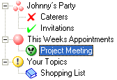
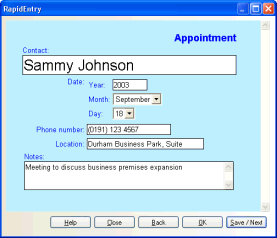
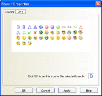
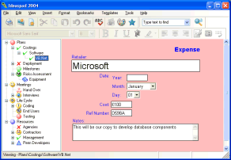

# Background

Ideaspad was written between 2002 and 2007, initially I wrote it for myself. I wanted something where I could write and maintain project notes, where I could build up certain areas in more detail.

Later the term “Mind Mapping” became relevant, a researcher contacted me asking for some additional features to help with this feature.

Also I had sales from companies, even a 20 user license.

At the time my background was in Visual Basic 6, VB.Net seemed the obvious progression.

Although the idea of sharing an MS Access database isn't ideal, this does work with a small number of users. Ideaspad provides some simply locking to make sharing more reliable.

# How to build / edit the code

You’ll need Microsoft Visual Basic .Net 2003, you can download this as part of your MSDN benefits.

You will also probably need to use Windows 7 or earlier.

Perhaps in future I may upgrade this project if this becomes a popular request.

You’ll also need to install Microsoft Data Access Components 2.8.

I have included a Components folder which includes most of the required DLLs.

You’ll notice there are two project files for Ideaspad and a number of DLLs suffixed with Debug, these are added to one solution for easier debugging. (Why, well there needs to be separate solution to allow for obfuscating / strong name signing, which is used in the batch files.)

So the easiest way to compile the project is to open \CodeLibrary\SharewareProjs\IdeasPad\IdeasPadDebug.sln

# What is Ideaspad?

## Helps you be more organised

 * Tree navigation, powerful information organisation feature, in a hierarchical manner.
 * Topics, sub topics and icons to help you identify your topic.
 * A personal information manager or database manager.
 * It could be described as a cardfile or guide card collection.
 * You can use it like a jotter pad, allowing easy access to topics.
 * Not only a text editor, but a word processor and more.

## Templates

{: height="186px" width="199px" margin="10px" align="left"}

 *  Basically a form in which to type your information.
 *  It's made using HTML so you can write your own, with a little HTML knowledge.

### The Ultimate Data Entry System, Create your own system
 *  Ideaspad gives you powerful features to create your own forms.
 *  You can add information which can be used as reference material or just to add your own notes.
 *  Create your own customised information collection or data entry system.

### Caters for creativity and future change
* Create your own Templates (HTML Forms) add as much complexity as required.
Template help topics and sample included to get you started.

### Allows you to spend less time entering information

 * Rapid entry, quickly enter your information using a template.
 * You can also drag and drop branches to reorganise topics.

### Build up your own structured system overnight using HTML

 * You can build a basic multi user system overnight, without the need for IT staff.
 * Then if your venture takes off, you can upgrade to a bigger dedicated system.
 * Build up structure information using templates, then you can export it a bigger system!

## Customization

&nbsp;&nbsp;

 *  There are three areas to customization
 1.	Templates, HTML Forms. 
 2.	Topics / Branches which you assign with your templates / rich text. 
 3.	General settings and bookmarks. 
With the latest version of Ideaspad you can create your own mini systems.

 

# Features

 * Rich Text Editor, Ideaspad uses Rich Text File format (or RTF) to allow colour and font 
 * formatting, similar to WordPad.
 * A basic word processor handling text and data.
 * Branch / Bookmark Icons.
 * Spell Checker, checks both text and templates (HTML Forms) text !!!
 * Use HTML forms to accept information, which is then stored within a database.
 * Rapid Entry.
 * Fully customizable.
 * Import Export features.

## Possible Uses
* Research Data Organizer
* Your own custom order entry system.
* A project stash / planner.
* Technical information repository.
* Your sighting or research card file.
* Your own recipe catalogue.
* A card file for your music collection.
* Custom home inventory store.
* A birthday / Christmas card diary.
* Scrap book.
* The possibilities are endless!

